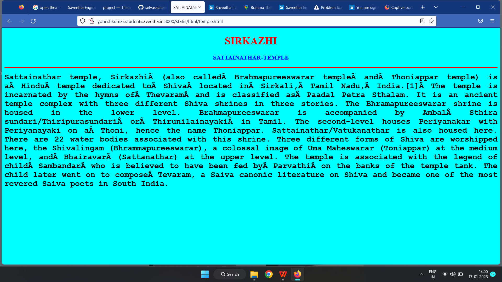

# Places Around Me
## AIM:
To develop a website to display details about the places around my house.

## Design Steps:

### Step 1:
clone the github repository into theia IDE.

### Step 2:
create a new Django project.

### Step 3:
write the needed HTML code.

### step 4:
Run the Django server and execute the HTML files.

## Code:
```
map.html
<!DOCTYPE html>
<html lang="en">
<head>
<title>My City</title>
</head>
<body>
<h1 align="center">
<font color="red"><b>Sirkazhi</b></font>
</h1>
<h3 align="center">
<font color="blue"><b>YOHESHKUMAR R.M (22008459)</b></font>
</h3>
<center>

<map name="MyCity">
<area shape="circle" coords="190,50,20" href="/static/html/temple.html" title="sattainathar temple">
<area shape="rectangle" coords="230,30,260,60" href="/static/html/palace.html" title="the grand white palace">
<area shape="circle" coords="400,350,50" href="/static/html/hotel.html" title="hotel sampoorna">
<area shape="circle" coords="400,200,75" href="/static/html/studios.html" title="glam studios">
<area shape="rectangle" coords="490,150,870,320" href="/static/html/park.html" title="gandhiPark">
</map>
</center>
</body>
</html>

temple.html
<!DOCTYPE html>
<html lang="en">
<head>
<title>SATTAINATAR-TEMPLE</title>
</head>
<body bgcolor="cyan">
<h1 align="center">
<font color="red"><b>SIRKAZHI</b></font>
</h1>
<h3 align="center">
<font color="blue"><b>SATTAINATHAR-TEMPLE</b></font>
</h3>
<hr size="3" color="red">
<p align="justify">
<font face="Courier New" size="5">
<b>
Sattainathar temple, Sirkazhi (also called Brahmapureeswarar temple and Thoniappar temple) is a Hindu temple dedicated to Shiva located in Sirkali, Tamil Nadu, India.[1] The temple is incarnated by the hymns of Thevaram and is classified as Paadal Petra Sthalam. It is an ancient temple complex with three different Shiva shrines in three stories.
The Bhramapureeswarar shrine is housed in the lower level. Brahmapureeswarar is accompanied by Ambal Sthira sundari/Thiripurasundari or Thirunilainayaki in Tamil. The second-level houses Periyanakar with Periyanayaki on a Thoni, hence the name Thoniappar. Sattainathar/Vatukanathar is also housed here. There are 22 water bodies associated with this shrine. Three different forms of Shiva are worshipped here, the Shivalingam (Bhrammapureeswarar), a colossal image of Uma Maheswarar (Toniappar) at the medium level, and Bhairavar (Sattanathar) at the upper level. The temple is associated with the legend of child Sambandar who is believed to have been fed by Parvathi on the banks of the temple tank. The child later went on to compose Tevaram, a Saiva canonic literature on Shiva and became one of the most revered Saiva poets in South India.
</b>	
</font>
</p>
</body>
</html> 

palace.html
<!DOCTYPE html>
<html lang="en">
<head>
<title>the grand white palace</title>
</head>
<body bgcolor="yellow">
<h1 align="center">
<font color="red"><b>SIRKAZHII</b></font>
</h1>
<h3 align="center">
<font color="blue"><b>the grand white palace</b></font>
</h3>
<hr size="3" color="red">
<p align="justify">
<font face="Tahoma" size="5">
Experience all that Sirkazhi has to offer when staying at the majestic Grand White Palace hotel with spacious luxury rooms and modern amenities
This hotel facilitates smooth hosting of corporate events, business meetings and seminars, and weddings with an equipped conference hall and banquet hall on the premises, aided by ample parking.
Car, motorbike/scooter and bicycle rentals, and airport transfers can be arranged by the hotel on request.
clean room. very courteous staff..the staff can dress better. reasonable food, 199 for new year dinner! they can make small changes to go to next class.
</font>
</p>
</body>
</html>

park.html
<!DOCTYPE html>
<html lang="en">
<head>
<title>gandhi park</title>
</head>
<body bgcolor="lime">
<h1 align="center">
<font color="red"><b>SIRKAZHI</b></font>
</h1>
<h3 align="center">
<font color="blue"><b>gandhi park</b></font>
</h3>
<hr size="3" color="red">
<p align="justify">
<font face="Georgia" size="5">
A very nice park near sirkali bus stand. 
Very superb calm place in sirkali. Best for walking. Nice playing place for kids.
Well maintained with jogging track. Source of ground water.
Good place play with children.  In Banyan Tree lot of parrot stay like house. 
Good sound and Air. Lake view park looks awesome.
Very nice place at sirkali.
Simple and relax with play area.
</font>
</p>
</body>
</html>

studios.html
<!DOCTYPE html>
<html lang="en">
<head>
<title>glam studios</title>
</head>
<body bgcolor="orange">
<h1 align="center">
<font color="red"><b>SIRKAZHI</b></font>
</h1>
<h3 align="center">
<font color="blue"><b>glam studios</b></font>
</h3>
<hr size="3" color="red">
<p align="justify">
<font face="Georgia" size="5">
A studio which grooms up our beauty by facial, haircut ,spa and massage
They have special packages for mirage,birthdays and many other functions
They upgrade our beauty and make memories by taking photographs
</font>
</p>
</body>
</html>

hotel.html
<!DOCTYPE html>
<html lang="en">
<head>
<title>hotel sampoorna</title>
</head>
<body bgcolor="pink">
<h1 align="center">
<font color="red"><b>SIRKAZHI</b></font>
</h1>
<h3 align="center">
<font color="blue"><b>hotel sampoorna</b></font>
</h3>
<hr size="3" color="red">
<p align="justify">
<font face="Arial" size="5">
<b>
This very good Hotel to stay in Shirkazi, Dist. nagapattim, Chennai rooms start from Rs.500/- from non.ac and AC Started from Rs.700/- onward. Centrally located hotel. Ok type hotel. Staff is Good and well. Shirkazi is city of Temple and beach. Only some people know Hindi language.
Plain uncomplicated South India meal (sathvic) is the call , then this is a great place.Has good food. Run by a small family. Seems with focus on quality rather than money.Catering is also an option .Good place to reach out for any religious ceremony in the temple town.
After enjoying Sattanathaswamy Temple, visit this restaurant that is not far away. But a number of guests who use Google didn't grant Sampoorna Restaurant a high rating.
</b>
</font>
</p>
</body>
</html>
```

## Output:





## HTML validator:


## Result
The program for implementing image map is executed sucessfully